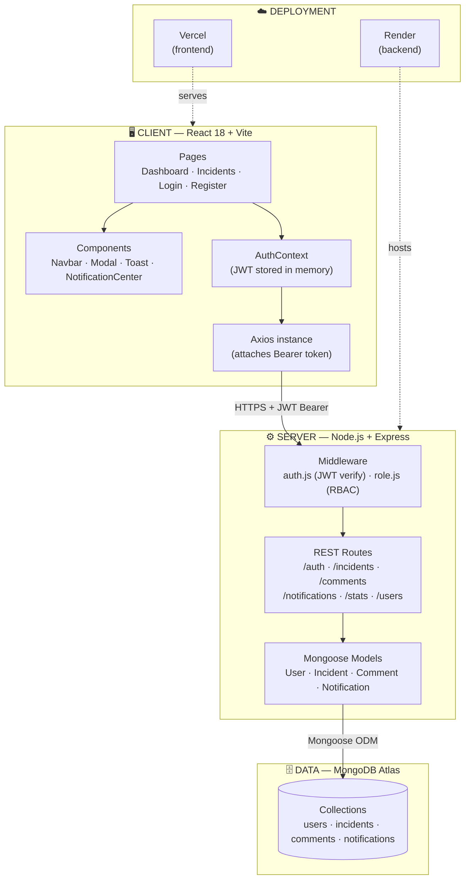
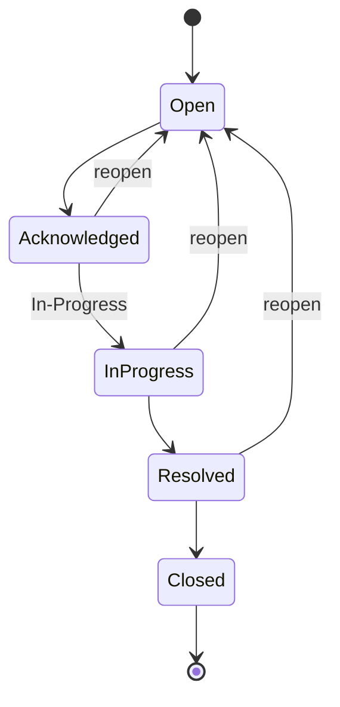

## 📖 Table of Contents

- [Overview](#overview)
- [Key Features](#-key-features)
- [Tech Stack](#️-tech-stack)
- [Architecture](#-architecture)
- [Project Structure](#-project-structure)
- [Database Models](#-database-models)
- [Getting Started](#️-getting-started)
- [Environment Variables](#-environment-variables)
- [Role-Based Permissions](#-role-based-permissions)
- [API Reference](#-api-reference)
- [Incident Workflow](#-incident-workflow)
- [Deployment](#-deployment)
- [Contributing](#-contributing)
- [License](#-license)

---

## 🛡️ Overview

**AEGIS** is a comprehensive incident management system designed for IT operations teams. It provides real-time incident tracking, role-based access control, team collaboration through threaded comments, smart notifications, and analytics dashboards — all wrapped in a responsive, animated UI.

Whether you're triaging a critical outage or reviewing post-incident metrics, Aegis keeps your team aligned with a single source of truth for every incident's lifecycle.

---

## 🚀 Key Features

| Feature | Description |
|---|---|
| 🔐 **Role-Based Access Control** | Three-tier permission system — Admin, Operator, and Viewer/User — with granular access to actions and data |
| 🧾 **Incident Lifecycle Management** | Full CRUD with a structured workflow: `Open → Acknowledged → In-Progress → Resolved → Closed` |
| 🎯 **Intelligent Assignment** | Manually assign incidents to operators or distribute automatically |
| 🔔 **Smart Notifications** | In-app notification center with real-time alerts for creation, updates, and comments |
| 💬 **Team Collaboration** | Threaded, timestamped comment discussions on every incident |
| 📊 **Analytics Dashboard** | Live metrics — open vs. resolved counts, severity breakdowns, resolution time, and recent activity |
| 🔍 **Advanced Filtering** | Filter and search by severity, status, or assignee |
| 🎨 **Modern UI/UX** | Responsive layout, Framer Motion animations, toasts, modals, skeleton loaders, and empty states |
| 🔑 **Secure Authentication** | Stateless JWT auth with bcrypt password hashing |

---

## 🛠️ Tech Stack

<table>
<tr>
<td valign="top" width="50%">

**Frontend**
- React 18.3
- Vite 5.x
- Tailwind CSS 3.x
- Framer Motion 11.x
- React Router 6.x
- Axios 1.x
- React Context API

</td>
<td valign="top" width="50%">

**Backend**
- Node.js 20+
- Express 4.x
- MongoDB + Mongoose
- JWT Authentication
- bcryptjs
- CORS
- dotenv

</td>
</tr>
</table>

**Deployment:** Vercel (frontend) · Render (backend) · MongoDB Atlas (database)

---

## 🏗️ Architecture



The client never talks to the database directly — every request flows through the Express API, where JWT auth and role middleware validate the caller before Mongoose touches MongoDB Atlas.

---

## 📁 Project Structure

```
incident-and-outage-management-platform/
├── client/                          # React frontend
│   ├── src/
│   │   ├── components/              # Reusable UI components
│   │   │   ├── ui/                  # Base UI (Modal, Skeleton, etc.)
│   │   │   ├── ConnectionStatus.jsx
│   │   │   ├── Layout.jsx
│   │   │   ├── Navbar.jsx
│   │   │   ├── NotificationCenter.jsx
│   │   │   ├── ProtectedRoute.jsx
│   │   │   └── Toast.jsx
│   │   ├── context/
│   │   │   └── AuthContext.jsx      # Auth state management
│   │   ├── pages/
│   │   │   ├── Dashboard.jsx        # Analytics dashboard
│   │   │   ├── Incidents.jsx        # Incident list + CRUD
│   │   │   ├── LandingHome.jsx      # Public landing page
│   │   │   ├── Login.jsx
│   │   │   └── Register.jsx
│   │   ├── utils/
│   │   │   └── animations.js        # Framer Motion variants
│   │   ├── App.jsx
│   │   ├── config.js                # API base URL
│   │   ├── main.jsx
│   │   └── index.css                # Tailwind imports
│   ├── index.html
│   ├── package.json
│   ├── vite.config.js
│   ├── tailwind.config.js
│   └── postcss.config.js
│
├── server/                          # Express backend
│   ├── middleware/
│   │   ├── auth.js                  # JWT verification
│   │   └── role.js                  # Role-based access control
│   ├── models/
│   │   ├── Comment.js
│   │   ├── Incident.js
│   │   ├── Notification.js
│   │   └── User.js
│   ├── routes/
│   │   ├── auth.js
│   │   ├── comments.js
│   │   ├── incidents.js
│   │   ├── notifications.js
│   │   ├── stats.js
│   │   └── users.js
│   ├── server.js                    # Entry point
│   └── package.json
│
├── render.yaml                      # Render config
├── vercel.json                      # Vercel config
├── LICENSE.md
└── README.md
```

---

## 🗃️ Database Models

<details>
<summary><strong>User</strong></summary>

```
_id          : ObjectId
username     : String   (required, unique)
email        : String   (required, unique)
password     : String   (hashed, required)
role         : String   (enum: admin | operator | user, default: user)
createdAt    : Date
updatedAt    : Date
```
</details>

<details>
<summary><strong>Incident</strong></summary>

```
_id          : ObjectId
title        : String   (required)
description  : String   (required)
severity     : String   (enum: low | medium | high | critical)
status       : String   (enum: open | in_progress | resolved | closed, default: open)
createdBy    : ObjectId (ref: User)
assignedTo   : ObjectId (ref: User, optional)
comments     : [ObjectId] (ref: Comment)
createdAt    : Date
updatedAt    : Date
```
</details>

<details>
<summary><strong>Comment</strong></summary>

```
_id          : ObjectId
incidentId   : ObjectId (ref: Incident)
userId       : ObjectId (ref: User)
content      : String   (required)
createdAt    : Date
updatedAt    : Date
```
</details>

<details>
<summary><strong>Notification</strong></summary>

```
_id          : ObjectId
userId       : ObjectId (ref: User)
message      : String   (required)
type         : String   (enum: incident_created | incident_updated | comment_added)
isRead       : Boolean  (default: false)
createdAt    : Date
```
</details>

---

## ⚙️ Getting Started

### Prerequisites

- **Node.js** v20 or higher
- **MongoDB** instance (local or [Atlas](https://www.mongodb.com/atlas))
- **npm** or **yarn**

### Installation

```bash
# 1. Clone the repository
git clone https://github.com/yourusername/incident-and-outage-management-platform.git
cd incident-and-outage-management-platform

# 2. Install server dependencies
cd server
npm install

# 3. Install client dependencies
cd ../client
npm install

# 4. Configure environment variables
# Create a .env file inside /server (see below)
```

### Running the App

```bash
# Terminal 1 — Server (http://localhost:5000)
cd server
npm run dev

# Terminal 2 — Client (http://localhost:5173)
cd client
npm run dev
```

### Initial Setup

Create an account through the registration page at `/register`. The first registered user can be promoted to **Admin** directly via the database.

**Default seeded accounts** (if seed data is used):

| Role | Email | Password |
|---|---|---|
| Admin | `admin@aegis.com` | `admin123` |
| Operator | `operator@aegis.com` | `operator123` |
| User | `user@aegis.com` | `user123` |

---

## 🔑 Environment Variables

**Server** — create `/server/.env`:

```env
PORT=5000
NODE_ENV=development
MONGO_URI=mongodb://localhost:27017/aegis
JWT_SECRET=your-super-secret-jwt-key-change-in-production
JWT_EXPIRES_IN=7d
CLIENT_URL=http://localhost:5173
```

**Client** — in `/client/src/config.js`:

```javascript
export const API_BASE_URL = 'http://localhost:5000/api';
// For production: 'https://your-backend.onrender.com/api'
```

---

## 🔐 Role-Based Permissions

| Permission | Admin | Operator | Viewer / User |
|---|:---:|:---:|:---:|
| View incidents | ✅ | ✅ | ✅ |
| Create incidents | ✅ | ✅ | ❌ |
| Edit incidents | ✅ | ✅ | ❌ |
| Delete incidents | ✅ | ❌ | ❌ |
| Assign operators | ✅ | ❌ | ❌ |
| Manage users | ✅ | ❌ | ❌ |
| View analytics | ✅ | ✅ | ✅ |
| Add comments | ✅ | ✅ | ✅ |
| Receive notifications | ✅ | ✅ | ✅ |

---

## 📊 API Reference

Base URL: `http://localhost:5000/api`

### Authentication — `/auth`

| Method | Endpoint | Description | Auth |
|---|---|---|:---:|
| `POST` | `/register` | Register a new user | ❌ |
| `POST` | `/login` | Log in and receive a JWT | ❌ |
| `GET` | `/me` | Get the current authenticated user | ✅ |

### Incidents — `/incidents`

| Method | Endpoint | Description | Auth | Role |
|---|---|---|:---:|---|
| `GET` | `/` | List all incidents | ✅ | All |
| `GET` | `/:id` | Get a single incident | ✅ | All |
| `POST` | `/` | Create an incident | ✅ | Admin, Operator |
| `PUT` | `/:id` | Update an incident | ✅ | Admin, Operator |
| `PUT` | `/:id/status` | Update incident status | ✅ | Admin, Operator |
| `PUT` | `/:id/assign` | Assign an operator | ✅ | Admin |
| `DELETE` | `/:id` | Delete an incident | ✅ | Admin |

### Notifications — `/notifications`

| Method | Endpoint | Description | Auth |
|---|---|---|:---:|
| `GET` | `/` | Get all notifications for the user | ✅ |
| `PUT` | `/:id/read` | Mark a notification as read | ✅ |
| `PUT` | `/read-all` | Mark all notifications as read | ✅ |

### Comments — `/comments`

| Method | Endpoint | Description | Auth |
|---|---|---|:---:|
| `GET` | `/:incidentId` | Get all comments for an incident | ✅ |
| `POST` | `/` | Add a comment to an incident | ✅ |

### Statistics — `/stats`

| Method | Endpoint | Description | Auth |
|---|---|---|:---:|
| `GET` | `/dashboard` | Dashboard analytics overview | ✅ |

### Users — `/users`

| Method | Endpoint | Description | Auth | Role |
|---|---|---|:---:|---|
| `GET` | `/` | List all users | ✅ | Admin |
| `GET` | `/:id` | Get a user by ID | ✅ | Admin |
| `PUT` | `/:id` | Update a user | ✅ | Admin |
| `DELETE` | `/:id` | Delete a user | ✅ | Admin |

---

## 🔄 Incident Workflow



Each transition triggers an in-app notification to relevant stakeholders and is timestamped for resolution-time analytics on the dashboard.

---

## 🚢 Deployment

### Frontend → Vercel

```bash
cd client
vercel
```

### Backend → Render

1. Connect your GitHub repository to Render
2. Create a new **Web Service**
3. Build command: `npm install`
4. Start command: `npm start`
5. Add the required environment variables (see [above](#-environment-variables))

### Database → MongoDB Atlas

1. Create a free cluster at [mongodb.com/atlas](https://www.mongodb.com/atlas)
2. Copy your connection string
3. Set it as `MONGO_URI` in your server environment

---

## 🤝 Contributing

Contributions, issues, and feature requests are welcome!

1. Fork the project
2. Create your feature branch (`git checkout -b feature/amazing-feature`)
3. Commit your changes (`git commit -m 'Add some amazing feature'`)
4. Push to the branch (`git push origin feature/amazing-feature`)
5. Open a Pull Request

---

## 📄 License

### ⚠️ Academic Integrity & Copyright Notice
> This project is hosted publicly solely for recruitment purposes to showcase my coding skills. It is strictly protected under standard copyright law. Plagiarism or copying this code for university assignments or external projects is strictly prohibited. For full legal terms, please refer to the [LICENSE.md](LICENSE.md) file.

---

<div align="center">

**Made with ❤️ by Spandan Mhaske**

If you find this project useful, consider giving it a ⭐ on GitHub!

</div>